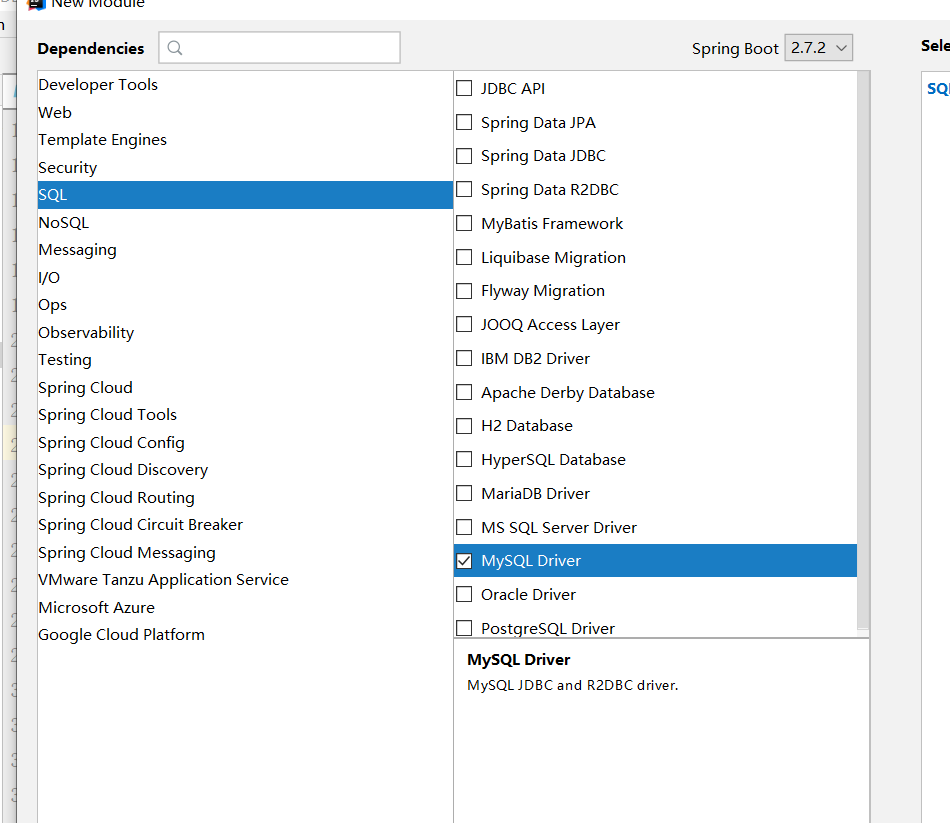
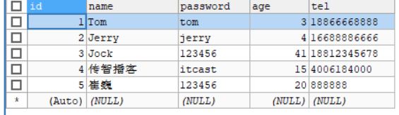
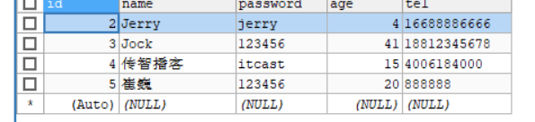
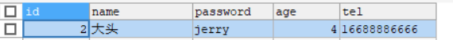
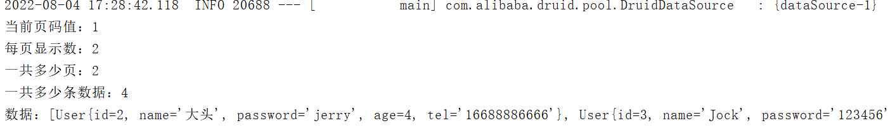
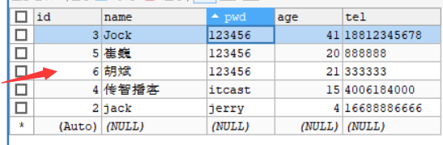
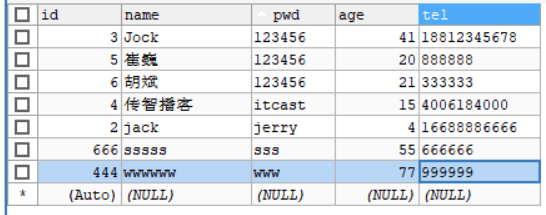
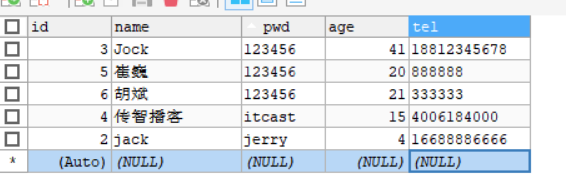
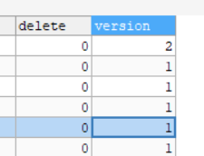

## MyBatisPlus

## 1，MyBatisPlus入门案例与简介

### 1.1 入门案例

* MybatisPlus(简称MP)是基于MyBatis框架基础上开发的增强型工具，旨在简化开发、提供效率。


#### 步骤1:创建数据库及表

```sql
create database if not exists mybatisplus_db character set utf8;
use mybatisplus_db;
CREATE TABLE user (
    id bigint(20) primary key auto_increment,
    name varchar(32) not null,
    password  varchar(32) not null,
    age int(3) not null ,
    tel varchar(32) not null
);
insert into user values(1,'Tom','tom',3,'18866668888');
insert into user values(2,'Jerry','jerry',4,'16688886666');
insert into user values(3,'Jock','123456',41,'18812345678');
insert into user values(4,'传智播客','itcast',15,'4006184000');
```

#### 步骤2:创建SpringBoot工程

#### 步骤3:勾选配置使用技术



**说明:**

* 由于MP并未被收录到idea的系统内置配置，无法直接选择加入，需要手动在pom.xml中配置添加

#### 步骤4:pom.xml补全依赖

```xml
  <dependency>
            <groupId>com.alibaba</groupId>
            <artifactId>druid</artifactId>
            <version>1.2.5</version>
        </dependency>
        <dependency>
            <groupId>com.baomidou</groupId>
            <artifactId>mybatis-plus-boot-starter</artifactId>
            <version>3.4.3</version>
        </dependency>
```

**说明:**

* druid数据源可以加也可以不加，SpringBoot有内置的数据源，可以配置成使用Druid数据源

* 从MP的依赖关系可以看出，通过依赖传递已经将MyBatis与MyBatis整合Spring的jar包导入，我们不需要额外在添加MyBatis的相关jar包


#### 步骤5:添加MP的相关配置信息

resources默认生成的是properties配置文件，可以将其替换成yml文件，并在文件中配置数据库连接的相关信息:`application.yml`

```yml
spring:
  datasource:
    type: com.alibaba.druid.pool.DruidDataSource
    driver-class-name: com.mysql.cj.jdbc.Driver
    url: jdbc:mysql://localhost:3306/mybatisplus_db?serverTimezone=UTC 
    username: root
    password: root
```

**说明:**==serverTimezone是用来设置时区，UTC是标准时区，和咱们的时间差8小时，所以可以将其修改为`Asia/Shanghai`==

#### 步骤6:根据数据库表创建实体类

```java
public class User {

    private Long id;
    private String name;
    private String password;
    private Integer age;
    private String tel;

    public Long getId() {
        return id;
    }

    public void setId(Long id) {
        this.id = id;
    }

    public String getName() {
        return name;
    }

    public void setName(String name) {
        this.name = name;
    }

    public String getPassword() {
        return password;
    }

    public void setPassword(String password) {
        this.password = password;
    }

    public Integer getAge() {
        return age;
    }

    public void setAge(Integer age) {
        this.age = age;
    }

    public String getTel() {
        return tel;
    }

    public void setTel(String tel) {
        this.tel = tel;
    }

    @Override
    public String toString() {
        return "User{" +
                "id=" + id +
                ", name='" + name + '\'' +
                ", password='" + password + '\'' +
                ", age=" + age +
                ", tel='" + tel + '\'' +
                '}';
    }

    public User() {
    }

    public User(Long id, String name, String password, Integer age, String tel) {
        this.id = id;
        this.name = name;
        this.password = password;
        this.age = age;
        this.tel = tel;
    }
}
```

#### 步骤7:创建Dao接口

```java
@Mapper
public interface UserDao extends BaseMapper<User>{
}
```

**说明:**Dao接口要想被容器扫描到，有两种解决方案:

* 方案一:在Dao接口上添加`@Mapper`注解，并且确保Dao处在引导类所在包或其子包中
  * 该方案的缺点是需要在每一Dao接口中添加注解
* 方案二:在引导类上添加`@MapperScan`注解，其属性为所要扫描的Dao所在包
  * 该方案的好处是只需要写一次，则指定包下的所有Dao接口都能被扫描到，`@Mapper`就可以不写。

#### 步骤8:编写测试类

```java
@SpringBootTest
class Mybatisplus01QuickstartApplicationTests {

@Autowired
private  UserDao userDao;
    @Test
    void testGetAll() {
        List<User> all = userDao.selectList(null);
        for (User user : all) {
            System.out.println(user);
        }
    }
}
```

在第一次的测试中，我出现了项目启动失败的异常，原因是因为我的坐标导错了，应该是：

```xml
 <dependency>
        <groupId>com.baomidou</groupId>
        <artifactId>mybatis-plus-boot-starter</artifactId>
        <version>3.4.3</version>
    </dependency>
```
而不是;

```xml
<dependency>
    <groupId>com.baomidou</groupId>
    <artifactId>mybatis-plus</artifactId>
    <version>3.4.3</version>
</dependency>
```

**说明:**

userDao注入的时候下面有红线提示的原因是什么?

* UserDao是一个接口，不能实例化对象

* 只有在服务器启动IOC容器初始化后，由框架创建DAO接口的代理对象来注入
* 现在服务器并未启动，所以代理对象也未创建，IDEA查找不到对应的对象注入，所以提示报红
* 一旦服务启动，就能注入其代理对象，所以该错误提示不影响正常运行。

### 1.2 MybatisPlus简介

MyBatisPlus（简称MP）是基于MyBatis框架基础上开发的增强型工具，旨在==简化开发、提高效率==

MyBatisPlus的官网为:`https://mp.baomidou.com/`

MP的特性:

- 无侵入：只做增强不做改变，不会对现有工程产生影响
- 强大的 CRUD 操作：内置通用 Mapper，少量配置即可实现单表CRUD 操作
- 支持 Lambda：编写查询条件无需担心字段写错
- 支持主键自动生成
- 内置分页插件
- ……

## 2，标准数据层开发

### 2.1 标准CRUD使用

### 2.2 新增

在进行新增之前，我们可以分析下新增的方法:

```java
int insert (T t)
```

* T:泛型，新增用来保存新增数据

* int:返回值，新增成功后返回1，没有新增成功返回的是0

在测试类中进行新增操作:

```java
@SpringBootTest
class Mybatisplus01QuickstartApplicationTests {

    @Autowired
    private UserDao userDao;

     /*
     添加用户
     */
    @Test
    void TestSave(){
        User user = new User();
        user.setId(5L);
        user.setName("崔巍");
        user.setAge(20);
        user.setPassword("123456");
        user.setTel("888888");
        userDao.insert(user);
    }
}
```

数据库就添加了一条数据：



### 2.3 删除

在进行删除之前，我们可以分析下删除的方法:

```java
int deleteById (Serializable id)
```

* Serializable：参数类型

  * String和Number是Serializable的子类，
  * Number又是Float,Double,Integer等类的父类，
  * 能作为主键的数据类型都已经是Serializable的子类，
  * MP使用Serializable作为参数类型，就好比我们可以用Object接收任何数据类型一样。

* int:返回值类型，数据删除成功返回1，未删除数据返回0。

在测试类中进行新增操作:

```java
 @SpringBootTest
class Mybatisplus01QuickstartApplicationTests {

    @Autowired
    private UserDao userDao;

  /**
     * 根据ID删除用户
     */
    @Test
    void testDelete(){
        userDao.deleteById(1);
    }
}

```

数据库就删除了一条数据：



### 2.4 修改

在进行修改之前，我们可以分析下修改的方法:

```java
int updateById(T t);
```

- T:泛型，需要修改的数据内容，注意因为是根据ID进行修改，所以传入的对象中需要有ID属性值

- int:返回值，修改成功后返回1，未修改数据返回0

在测试类中进行新增操作:

```java
@SpringBootTest
class Mybatisplus01QuickstartApplicationTests {

    @Autowired
    private UserDao userDao;
    /**
     * 修改用户
     */
    @Test
    void testUpdate(){
        User user = new User();
        user.setId(2L);
        user.setName("大头");
        userDao.updateById(user);
    }
}
```

**说明:**修改的时候，只修改实体对象中有值的字段。

数据库中的数据被更新了：



### 2.5 根据ID查询

在进行根据ID查询之前，我们可以分析下根据ID查询的方法:

```java
T selectById (Serializable id)
```

- Serializable：参数类型,主键ID的值
- T:根据ID查询只会返回一条数据

在测试类中进行新增操作:

```java
@SpringBootTest
class Mybatisplus01QuickstartApplicationTests {

    @Autowired
    private UserDao userDao;
    
  /**
     * 根据ID查询
     */
    
    @Test
    void testGetById(){
        User user = userDao.selectById(3L);
        System.out.println(user);
    }
}
```

### 2.6 查询所有

在进行查询所有之前，我们可以分析下查询所有的方法:

```java
List<T> selectList(Wrapper<T> queryWrapper)
```

- Wrapper：用来构建条件查询的条件，目前我们没有可直接传为Null
- List<T>:因为查询的是所有，所以返回的数据是一个集合

在测试类中进行新增操作:

```java
@SpringBootTest
class Mybatisplus01QuickstartApplicationTests {

    @Autowired
    private UserDao userDao;
    
    @Test
    void testGetAll() {
        List<User> userList = userDao.selectList(null);
        System.out.println(userList);
    }
}
```

### 2.7 Lombok

#### 概念

* Lombok，一个Java类库，提供了一组注解，简化POJO实体类开发。

#### 使用步骤

##### 步骤1:添加lombok依赖

```xml
<dependency>
    <groupId>org.projectlombok</groupId>
    <artifactId>lombok</artifactId>
    <!--<version>1.18.12</version>-->
</dependency>
```

**注意：**版本可以不用写，因为SpringBoot中已经管理了lombok的版本。

##### 步骤2:安装Lombok的插件

新版本IDEA已经内置了该插件，如果删除setter和getter方法程序有报红，则需要安装插件

如果在IDEA中找不到lombok插件，可以访问如下网站

`https://plugins.jetbrains.com/plugin/6317-lombok/versions`

根据自己IDEA的版本下载对应的lombok插件，下载成功后，在IDEA中采用离线安装的方式进行安装。

##### 步骤3:模型类上添加注解

Lombok常见的注解有:

* @Setter:为模型类的属性提供setter方法
* @Getter:为模型类的属性提供getter方法
* @ToString:为模型类的属性提供toString方法
* @EqualsAndHashCode:为模型类的属性提供equals和hashcode方法
* ==@Data:是个组合注解，包含上面的注解的功能==
* ==@NoArgsConstructor:提供一个无参构造函数==
* ==@AllArgsConstructor:提供一个包含所有参数的构造函数==

Lombok的注解还有很多，上面标红的三个是比较常用的，其他的大家后期用到了，再去补充学习。

```java
@Data
@AllArgsConstructor
@NoArgsConstructor
public class User {
    private Long id;
    private String name;
    private String password;
    private Integer age;
    private String tel;
}
```

**说明:**

Lombok只是简化模型类的编写，我们之前的方法也能用，比如有人会问:我如果只想要有name和password的构造函数，该如何编写?

```java
@Data
@AllArgsConstructor
@NoArgsConstructor
public class User {
    private Long id;
    private String name;
    private String password;
    private Integer age;
    private String tel;

    public User(String name, String password) {
        this.name = name;
        this.password = password;
    }
}
```

### 2.8 分页功能

分页查询使用的方法是:

```java
IPage<T> selectPage(IPage<T> page, Wrapper<T> queryWrapper)
```

- IPage:用来构建分页查询条件
- Wrapper：用来构建条件查询的条件，目前我们没有可直接传为Null
- IPage:返回值，你会发现构建分页条件和方法的返回值都是IPage

IPage是一个接口，我们需要找到它的实现类来构建它，具体的实现类，可以进入到IPage类中按ctrl+h,会找到其有一个实现类为`Page`。

#### 步骤1:调用方法传入参数获取返回值

```java
@SpringBootTest
class Mybatisplus01QuickstartApplicationTests {

    @Autowired
    private UserDao userDao;
    /**
     * 分页查询
     *
     */
    void testSelectpage(){
        //1 创建IPage分页对象,设置分页参数,1为当前页码，2为每页显示的记录数
        IPage page = new Page(1,2);
        //2.执行分页查询
        userDao.selectPage(page ,null);
        System.out.println("当前页码值："+page.getCurrent());
        System.out.println("每页显示数："+page.getSize());
        System.out.println("一共多少页："+page.getPages());
        System.out.println("一共多少条数据："+page.getTotal());
        System.out.println("数据："+page.getRecords());
    }
}
```

我们直接执行，没有分页，还是查询到了全部的数据，所以我们要进行步骤二

#### 步骤2:设置分页拦截器

这个拦截器MP已经为我们提供好了，我们只需要将其配置成Spring管理的bean对象即可。

```java
@Configuration
public class MybatisPlusConfig {
    
    @Bean
    public MybatisPlusInterceptor mybatisPlusInterceptor(){
        //1 创建MybatisPlusInterceptor拦截器对象
        MybatisPlusInterceptor mpInterceptor=new MybatisPlusInterceptor();
        //2 添加分页拦截器
        mpInterceptor.addInnerInterceptor(new PaginationInnerInterceptor());
        return mpInterceptor;
    }
}
```

这些内容在MP的官方文档中有详细的说明，我们可以查看官方文档类配置

注意，这里有两种方式将MybatisPlusConfig 加载到Spring容器中（）上面是第一种

第二种：

```java
public class MpConfig {
    @Bean
    public MybatisPlusInterceptor mybatisPlusInterceptor(){
        //1 创建MybatisPlusInterceptor拦截器对象
        MybatisPlusInterceptor mpInterceptor=new MybatisPlusInterceptor();
        //2 添加分页拦截器
        mpInterceptor.addInnerInterceptor(new PaginationInnerInterceptor());
        return mpInterceptor;
    }
}
```

```java
@SpringBootApplication
@Import(MpConfig.class)   /// 这儿有变化
public class Mybatisplus01QuickstartApplication {

    public static void main(String[] args) {
        SpringApplication.run(Mybatisplus01QuickstartApplication.class, args);
    }

}
```

#### 步骤3:运行测试程序

如果想查看MP执行的SQL语句，可以修改application.yml配置文件，

```yml
  #开启日志文件
    mybatis-plus:
      configuration:
        log-impl: org.apache.ibatis.logging.stdout.StdOutImpl #打印SQL日志到控制台
```



## 3，DQL编程控制

增删改查四个操作中，查询是非常重要的也是非常复杂的操作

* 条件查询方式
* 查询投影
* 查询条件设定
* 字段映射与表名映射

### 3.1 条件查询

#### 3.1.1 条件查询的类

* MyBatisPlus将书写复杂的SQL查询条件进行了封装，使用编程的形式完成查询条件的组合。

这个我们在前面都有见过，比如查询所有和分页查询的时候，都有看到过一个`Wrapper`类，这个类就是用来构建查询条件的。

#### 3.1.2 环境构建

在构建条件查询之前，我们先来准备下环境

* 创建一个SpringBoot项目

* pom.xml中添加对应的依赖

  ```xml
  <?xml version="1.0" encoding="UTF-8"?>
  <project xmlns="http://maven.apache.org/POM/4.0.0" xmlns:xsi="http://www.w3.org/2001/XMLSchema-instance"
           xsi:schemaLocation="http://maven.apache.org/POM/4.0.0 https://maven.apache.org/xsd/maven-4.0.0.xsd">
      <modelVersion>4.0.0</modelVersion>
      <parent>
          <groupId>org.springframework.boot</groupId>
          <artifactId>spring-boot-starter-parent</artifactId>
          <version>2.5.0</version>
      </parent>
      <groupId>com.itheima</groupId>
      <artifactId>mybatisplus_02_dql</artifactId>
      <version>0.0.1-SNAPSHOT</version>
      <properties>
          <java.version>1.8</java.version>
      </properties>
      <dependencies>
  
          <dependency>
              <groupId>com.baomidou</groupId>
              <artifactId>mybatis-plus-boot-starter</artifactId>
              <version>3.4.1</version>
          </dependency>
  
          <dependency>
              <groupId>org.springframework.boot</groupId>
              <artifactId>spring-boot-starter</artifactId>
          </dependency>
  
          <dependency>
              <groupId>com.alibaba</groupId>
              <artifactId>druid</artifactId>
              <version>1.1.16</version>
          </dependency>
  
          <dependency>
              <groupId>mysql</groupId>
              <artifactId>mysql-connector-java</artifactId>
              <scope>runtime</scope>
          </dependency>
  
          <dependency>
              <groupId>org.springframework.boot</groupId>
              <artifactId>spring-boot-starter-test</artifactId>
              <scope>test</scope>
          </dependency>
  
          <dependency>
              <groupId>org.projectlombok</groupId>
              <artifactId>lombok</artifactId>
          </dependency>
  
      </dependencies>
  
      <build>
          <plugins>
              <plugin>
                  <groupId>org.springframework.boot</groupId>
                  <artifactId>spring-boot-maven-plugin</artifactId>
              </plugin>
          </plugins>
      </build>
  
  </project>
  
  ```
  
* 编写UserDao接口

  ```java
  @Mapper
  public interface UserDao extends BaseMapper<User> {
  }
  ```

* 编写模型类

  ```java
  @Data
  public class User {
      private Long id;
      private String name;
      private String password;
      private Integer age;
      private String tel;
  }
  ```

* 编写引导类

  ```java
  @SpringBootApplication
  public class Mybatisplus02DqlApplication {
  
      public static void main(String[] args) {
          SpringApplication.run(Mybatisplus02DqlApplication.class, args);
      }
  
  }
  ```

* 编写配置文件

  ```yml
  # dataSource
  spring:
    datasource:
      type: com.alibaba.druid.pool.DruidDataSource
      driver-class-name: com.mysql.cj.jdbc.Driver
      url: jdbc:mysql://localhost:3306/mybatisplus_db?serverTimezone=UTC
      username: root
      password: root
  # mp日志
  mybatis-plus:
    configuration:
      log-impl: org.apache.ibatis.logging.stdout.StdOutImpl
  ```

* 编写测试类

  ```java
  @SpringBootTest
  class Mybatisplus02DqlApplicationTests {
  
      @Autowired
      private UserDao userDao;
      
      @Test
      void testGetAll(){
          List<User> userList = userDao.selectList(null);
          System.out.println(userList);
      }
  }
  ```

  最终创建的项目结构为:

* 测试的时候，控制台打印的日志比较多，通过下面方法清除。

  * 取消初始化spring日志打印，resources目录下添加logback.xml，名称固定，内容如下:

    ```xml
    <?xml version="1.0" encoding="UTF-8"?>
    <configuration>
    </configuration>
    ```

  * 取消MybatisPlus启动banner图标

    application.yml添加如下内容:

    ```yml
mybatis-plus:
      global-config:
      banner: false //关闭图标显示
    ```
    
  * 取消SpringBoot的log打印
  
    application.yml添加如下内容:
  
    ```yml
  spring:
    main:
        banner-mode: off  //关闭SpringBoot启动图标(banner)
    ```
  ```
  
  ```

#### 3.1.3 构建条件查询

在进行查询的时候，我们的入口是在Wrapper这个类上，因为它是一个接口，所以我们需要去找它对应的实现类，关于实现类也有很多，说明我们有多种构建查询条件对象的方式

1. 先来看第一种:==QueryWrapper==

```java
@SpringBootTest
class Mybatisplus02DqlApplicationTests {

    @Autowired
    private UserDao userDao;
    
    /**
     * 条件查询方式一
     */
    @Test
    void GerALL1(){
        QueryWrapper<User> w = new QueryWrapper<User>();
        w.lt("age",18);
        List<User> all = userDao.selectList(w);
        for (User user : all) {
            System.out.println(user);
        }
    }
}
```

* lt: 小于(<) ,最终的sql语句为

  ```sql
  SELECT id,name,password,age,tel FROM user WHERE (age < ?)
  ```

- gt：大于(>),最终的SQL语句为

- ```mysql
  SELECT id,name,password,age,tel FROM user WHERE ( age > ?)
  ```

2.接着来看第二种:==QueryWrapper的基础上使用lambda==

```java
@SpringBootTest
class Mybatisplus02DqlApplicationTests {

    @Autowired
    private UserDao userDao;
    
      /**
     * 多条件查询方式二
     */
    @Test
    void GerALL2(){
        QueryWrapper<User> w = new QueryWrapper<User>();
      w.lambda().lt(User::getAge,18);
        List<User> all = userDao.selectList(w);
        for (User user : all) {
            System.out.println(user);
        }
    }
}
```

* User::getAget,为lambda表达式中的，类名::方法名，最终的sql语句为:

```sql
SELECT id,name,password,age,tel FROM user WHERE (age < ?)
```

**注意:**构建LambdaQueryWrapper的时候泛型不能省。

3. 接着来看第三种:==LambdaQueryWrapper==

```java
@SpringBootTest
class Mybatisplus02DqlApplicationTests {

    @Autowired
    private UserDao userDao;
  /**
     * 多条件查询方式三
     */
    @Test
    void GetAll3(){
        LambdaQueryWrapper<User> w = new LambdaQueryWrapper<>();
        w.lt(User::getAge, 10);
        List<User> userList = userDao.selectList(w);
        System.out.println(userList);

    }
}
```

#### 3.1.4 多条件构建

学完了三种构建查询对象的方式，每一种都有自己的特点，所以用哪一种都行，刚才都是一个条件，那如果有多个条件该如何构建呢?

> 需求:查询数据库表中，年龄在10岁到30岁之间的用户信息

```java
@SpringBootTest
class Mybatisplus02DqlApplicationTests {

    @Autowired
    private UserDao userDao;
    
    @Test
    void testGetAll(){
        LambdaQueryWrapper<User> lqw = new LambdaQueryWrapper<User>();
        lqw.lt(User::getAge, 30);
        lqw.gt(User::getAge, 10);
        List<User> userList = userDao.selectList(lqw);
        System.out.println(userList);
    }
}
```


* 构建多条件的时候，可以支持链式编程

  ```java
  LambdaQueryWrapper<User> lqw = new LambdaQueryWrapper<User>();
  lqw.lt(User::getAge, 30).gt(User::getAge, 10);
  List<User> userList = userDao.selectList(lqw);
  System.out.println(userList);
  ```

> 需求:查询数据库表中，年龄小于10或年龄大于30的数据

```java
@SpringBootTest
class Mybatisplus02DqlApplicationTests {

    @Autowired
    private UserDao userDao;
    
    @Test
    void testGetAll(){
        LambdaQueryWrapper<User> lqw = new LambdaQueryWrapper<User>();
        lqw.lt(User::getAge, 10).or().gt(User::getAge, 30);
        List<User> userList = userDao.selectList(lqw);
        System.out.println(userList);
    }
}
```

* or()就相当于我们sql语句中的`or`关键字,不加默认是`and`，最终的sql语句为:

  ```sql
  SELECT id,name,password,age,tel FROM user WHERE (age < ? OR age > ?)
  ```

#### 3.1.5 null判定

* 我们在做条件查询的时候，一般会有很多条件可以供用户进行选择查询。
* 这些条件用户可以选择使用也可以选择不使用，比如我要查询价格在8000以上的手机
* 在输入条件的时候，价格有一个区间范围，按照需求只需要在第一个价格输入框中输入8000
* 后台在做价格查询的时候，一般会让 price>值1 and price <值2
* 因为前端没有输入值2，所以如果不处理的话，就会出现 price>8000 and price < null问题
* 这个时候查询的结果就会出问题，具体该如何解决?

> 需求:查询数据库表中，根据输入年龄范围来查询符合条件的记录
>
> 用户在输入值的时候，
>
> ​	如果只输入第一个框，说明要查询大于该年龄的用户
>
> ​	如果只输入第二个框，说明要查询小于该年龄的用户
>
> ​    如果两个框都输入了，说明要查询年龄在两个范围之间的用户

我们可以使用两个简单数据类型，也可以使用一个模型类，但是User类中目前只有一个age属性,如:

```java
@Data
public class User {
    private Long id;
    private String name;
    private String password;
    private Integer age;
    private String tel;
}
```

方案一:添加属性age2,这种做法可以但是会影响到原模型类的属性内容

```java
@Data
public class User {
    private Long id;
    private String name;
    private String password;
    private Integer age;
    private String tel;
    private Integer age2;
}
```

方案二:新建一个模型类,让其继承User类，并在其中添加age2属性，UserQuery在拥有User属性后同时添加了age2属性。

```java
@Data
public class User {
    private Long id;
    private String name;
    private String password;
    private Integer age;
    private String tel;
}

@Data
public class UserQuery extends User {
    private Integer age2;
}
```

环境准备好后，我们来实现下刚才的需求：

```java
@SpringBootTest
class Mybatisplus02DqlApplicationTests {

    @Autowired
    private UserDao userDao;
    
    @Test
    void testGetAll(){
        //模拟页面传递过来的查询数据
        UserQuery uq = new UserQuery();
        uq.setAge(10);
        uq.setAge2(30);
        LambdaQueryWrapper<User> lqw = new LambdaQueryWrapper<User>();
        if(null != uq.getAge2()){
            lqw.lt(User::getAge, uq.getAge2());
        }
        if( null != uq.getAge()) {
            lqw.gt(User::getAge, uq.getAge());
        }
        List<User> userList = userDao.selectList(lqw);
        System.out.println(userList);
    }
}
```

上面的写法可以，但是有太多的if，代码量太多了。

```java
@SpringBootTest
class Mybatisplus02DqlApplicationTests {

    @Autowired
    private UserDao userDao;
    
    /**
     * null值的判定
     */
    @Test
    void GetAll(){
        UserQuery uq  = new UserQuery();
        //uq.setAge(10);
        uq.setAge2(30);
        LambdaQueryWrapper<User> w = new LambdaQueryWrapper<>();
        //先判定第一个参数是否为true,如果为true连接当前条件
        w.lt(null!=uq.getAge2(),User::getAge,uq.getAge2());
        w.gt(null!=uq.getAge(),User::getAge,uq.getAge());
        List<User> userList = userDao.selectList(w);
        System.out.println(userList);
    }
}
```

* lt()方法

  condition为boolean类型，返回true，则添加条件，返回false则不添加条件

### 3.2 查询投影

#### 3.2.1 查询指定字段

查询投影：只查询出指定内容的数据。

```java
@SpringBootTest
class Mybatisplus02DqlApplicationTests {

    @Autowired
    private UserDao userDao;
    
    /**
     * Lambda查询投影
     */

    @Test
void GetAll5(){
        LambdaQueryWrapper<User> w = new LambdaQueryWrapper<>();
        w.select(User::getId,User::getAge,User::getName,User::getTel);
        List<User> userList = userDao.selectList(w);
        for (User user : userList) {
            System.out.println(user);
        }
}
}
```

* select(...)方法用来设置查询的字段列，可以设置多个，最终的sql语句为:

  ```sql
  SELECT id,name,age FROM user
  ```

* 如果使用的不是lambda，就需要手动指定字段

  ```java
  @SpringBootTest
  class Mybatisplus02DqlApplicationTests {
  
      @Autowired
      private UserDao userDao;
    /**
   * 查询投影 普通方式
   */
  @Test
  void GetAll6(){
     QueryWrapper<User> w = new QueryWrapper<>();
      w.select("id","name","age","tel");
      List<User> userList = userDao.selectList(w);
      for (User user : userList) {
          System.out.println(user);
    }
  }
  }
  ```
  
  * ```mysql
    最终的sql语句为:SELECT id,name,age,tel FROM user
    ```

#### 3.2.2 聚合查询

这里就不能使用selectList方法了，使用selectMaps方法。

> 需求:聚合函数查询，完成count、max、min、avg、sum的使用
>
> count:总记录数
>
> max:最大值
>
> min:最小值
>
> avg:平均值
>
> sum:求和

```java
@SpringBootTest
class Mybatisplus02DqlApplicationTests {

    @Autowired
    private UserDao userDao;   
/**
 * 查询投影的聚合查询
 */
@Test
void GetAll7(){
    QueryWrapper<User> w = new QueryWrapper<>();
    w.select("count(*) as account");
    List<Map<String, Object>> maps = userDao.selectMaps(w);
    for (Map<String, Object> map : maps) {
        System.out.println(map);
    }
}

}
```

#### 3.2.3 分组查询

> 需求:分组查询，完成 group by的查询使用

```java
@SpringBootTest
class Mybatisplus02DqlApplicationTests {

    @Autowired
    private UserDao userDao;
 * 查询投影的分组查询
 */
@Test
void GetAll8(){
    QueryWrapper<User> w = new QueryWrapper<>();
    w.select("count(*) as account","tel");
    w.groupBy("tel");
    List<Map<String, Object>> maps = userDao.selectMaps(w);
    for (Map<String, Object> map : maps) {
        System.out.println(map);
    }
}
```

* groupBy为分组，最终的sql语句为

  ```sql
  SELECT count(*) as count,tel FROM user GROUP BY tel
  ```

**注意:**

* 聚合与分组查询，无法使用lambda表达式来完成
* MP只是对MyBatis的增强，如果MP实现不了，我们可以直接在DAO接口中使用MyBatis的方式实现

### 3.3 查询条件

前面我们只使用了lt()和gt(),除了这两个方法外，MP还封装了很多条件对应的方法，这一节我们重点把MP提供的查询条件方法进行学习下。

MP的查询条件有很多:

* 范围匹配（> 、 = 、between）
* 模糊匹配（like）
* 空判定（null）
* 包含性匹配（in）
* 分组（group）
* 排序（order）
* ……

#### 3.3.1 等值查询

> 需求:根据用户名和密码查询用户信息

```java
@SpringBootTest
class Mybatisplus02DqlApplicationTests {

    @Autowired
    private UserDao userDao;
    
    /**
     * 等值查询
     *
     */
    @Test
    void GetAll(){
        LambdaQueryWrapper<User> lqw = new LambdaQueryWrapper<>();
        lqw.eq(User::getName,"大头").eq(User::getPassword,"jerry");
        User user = userDao.selectOne(lqw);
        System.out.println(user);
    }
}
```

* eq()： 相当于 `=`,对应的sql语句为

  ```sql
  SELECT id,name,password,age,tel FROM user WHERE (name = ? AND password = ?)
  ```

* selectList：查询结果为多个或者单个

* selectOne:查询结果为单个

#### 3.3.2 范围查询

> 需求:对年龄进行范围查询，使用lt()、le()、gt()、ge()、between()进行范围查询

```java
@SpringBootTest
class Mybatisplus02DqlApplicationTests {

    @Autowired
    private UserDao userDao;
    
     /**
     * 等值查询
     *
     */
    @Test
    void GetAll(){
        LambdaQueryWrapper<User> lqw = new LambdaQueryWrapper<>();
        lqw.between(User::getAge,10,30);
        List<User> users = userDao.selectList(lqw);
        System.out.println(users);
    }
}
```

* gt():大于(>)
* ge():大于等于(>=)
* lt():小于(<)
* lte():小于等于(<=)
* between():between ? and ?

#### 3.3.3 模糊查询

> 需求:查询表中name属性的值以`J`开头的用户信息,使用like进行模糊查询

```java
@SpringBootTest
class Mybatisplus02DqlApplicationTests {

    @Autowired
    private UserDao userDao;
    
   /**
     * 模糊查询
     */
    @Test
    void GetAll10(){
        LambdaQueryWrapper<User> lqw = new LambdaQueryWrapper<>();
       lqw.like(User::getName,"j");
        List<User> users = userDao.selectList(lqw);
        System.out.println(users);
    }
}
```

* like():前后加百分号,如 %J%
* likeLeft():前面加百分号,如 %J
* likeRight():后面加百分号,如 J%

#### 3.3.4 排序查询

> 需求:查询所有数据，然后按照id降序

```java
@SpringBootTest
class Mybatisplus02DqlApplicationTests {

    @Autowired
    private UserDao userDao;
    
    @Test
    void testGetAll(){
        LambdaQueryWrapper<User> lwq = new LambdaQueryWrapper<>();
        /**
         * condition ：条件，返回boolean，
         		当condition为true，进行排序，如果为false，则不排序
         * isAsc:是否为升序，true为升序，false为降序
         * columns：需要操作的列
         */
        lwq.orderBy(true,false, User::getId);
        userDao.selectList(lw
    }
}
```

`https://mpbaomidou.com/guide/wrapper.html#abstractwrapper`   （这个网站可以查询其他方法）

### 3.4 映射匹配兼容性

我们已经能从表中查询出数据，并将数据封装到模型类中，这整个过程涉及到一张表和一个模型类:

之所以数据能够成功的从表中获取并封装到模型对象中，原因是表的字段列名和模型类的属性名一样。但是这也存在一些问题：

#### 问题1:表字段与编码属性设计不同步

当表的列名和模型类的属性名发生不一致，就会导致数据封装不到模型对象，这个时候就需要其中一方做出修改，那如果前提是两边都不能改又该如何解决?

MP给我们提供了一个注解`@TableField`,使用该注解可以实现模型类属性名和表的列名之间的映射关系

```java
@TableField（value = 'pwd'）
```

#### 问题2:编码中添加了数据库中未定义的属性

当模型类中多了一个数据库表不存在的字段，就会导致生成的sql语句中在select的时候查询了数据库不存在的字段，程序运行就会报错，错误信息为:

==Unknown column '多出来的字段名称' in 'field list'==

具体的解决方案用到的还是`@TableField`注解，它有一个属性叫`exist`，设置该字段是否在数据库表中存在，如果设置为false则不存在，生成sql语句查询的时候，就不会再查询该字段了。

```java
`@TableField`（`exist`=false）
```

#### 问题3：采用默认查询开放了更多的字段查看权限

查询表中所有的列的数据，就可能把一些敏感数据查询到返回给前端，这个时候我们就需要限制哪些字段默认不要进行查询。解决方案是`@TableField`注解的一个属性叫`select`，该属性设置默认是否需要查询该字段的值，true(默认值)表示默认查询该字段，false表示默认不查询该字段。

```java
@TableField（value = 'pwd'，select =false）
```

#### 知识点1：@TableField

| 名称     | @TableField                                                  |
| -------- | ------------------------------------------------------------ |
| 类型     | ==属性注解==                                                 |
| 位置     | 模型类属性定义上方                                           |
| 作用     | 设置当前属性对应的数据库表中的字段关系                       |
| 相关属性 | value(默认)：设置数据库表字段名称<br/>exist:设置属性在数据库表字段中是否存在，默认为true，此属性不能与value合并使用<br/>select:设置属性是否参与查询，此属性与select()映射配置不冲突 |

#### 问题4:表名与编码开发设计不同步

该问题主要是表的名称和模型类的名称不一致，导致查询失败，这个时候通常会报如下错误信息:

==Table 'databaseName.tableNaem' doesn't exist==,翻译过来就是数据库中的表不存在。

解决方案是使用MP提供的另外一个注解`@TableName`来设置表与模型类之间的对应关系。

在模型上添加：@TableName（“表名”）

#### 知识点2：@TableName

| 名称     | @TableName                    |
| -------- | ----------------------------- |
| 类型     | ==类注解==                    |
| 位置     | 模型类定义上方                |
| 作用     | 设置当前类对应于数据库表关系  |
| 相关属性 | value(默认)：设置数据库表名称 |

##### 模型类添加@TableName注解

```java
@Data
@TableName("tbl_user")
public class User {
    private Long id;
    private String name;
    private String password;
    private Integer age;
    private String tel;
}
```

##### 将字段password修改成pwd

##### 使用@TableField映射关系

```java
@Data
@TableName("tbl_user")
public class User {
    private Long id;
    private String name;
    @TableField(value="pwd")
    private String password;
    private Integer age;
    private String tel;
}
```

##### 添加一个数据库表不存在的字段

```java
@Data
@TableName("tbl_user")
public class User {
    private Long id;
    private String name;
    @TableField(value="pwd")
    private String password;
    private Integer age;
    private String tel;
    private Integer online;
}
```

##### 使用@TableField排除字段

```java
@Data
@TableName("tbl_user")
public class User {
    private Long id;
    private String name;
    @TableField(value="pwd")
    private String password;
    private Integer age;
    private String tel;
    @TableField(exist=false)
    private Integer online;
}
```

##### 查询时将pwd隐藏

```java
@Data
@TableName("tbl_user")
public class User {
    private Long id;
    private String name;
    @TableField(value="pwd",select=false)
    private String password;
    private Integer age;
    private String tel;
    @TableField(exist=false)
    private Integer online;
}
```

## 4，DML编程控制

### 4.1 id生成策略控制

前面我们在新增的时候留了一个问题，就是新增成功后，主键ID是一个很长串的内容，我们更想要的是按照数据库表字段进行自增长，在解决这个问题之前，我们先来分析下ID该如何选择:

* 不同的表应用不同的id生成策略
  * 日志：自增（1,2,3,4，……）
  * 购物订单：特殊规则（FQ23948AK3843）
  * 外卖单：关联地区日期等信息（10 04 20200314 34 91）
  * 关系表：可省略id
  * ……

不同的业务采用的ID生成方式应该是不一样的，那么在MP中都提供了哪些主键生成策略，以及我们该如何进行选择?

在这里我们又需要用到MP的一个注解叫`@TableId`

#### 知识点1：@TableId

| 名称     | @TableId                                                     |
| -------- | ------------------------------------------------------------ |
| 类型     | ==属性注解==                                                 |
| 位置     | 模型类中用于表示主键的属性定义上方                           |
| 作用     | 设置当前类中主键属性的生成策略                               |
| 相关属性 | value(默认)：设置数据库表主键名称<br/>type:设置主键属性的生成策略，值查照IdType的枚举值 |

#### 4.1.1 环境构建

在构建条件查询之前，我们先来准备下环境

- 创建一个SpringBoot项目

- pom.xml中添加对应的依赖

  ```xml
  <?xml version="1.0" encoding="UTF-8"?>
  <project xmlns="http://maven.apache.org/POM/4.0.0" xmlns:xsi="http://www.w3.org/2001/XMLSchema-instance"
           xsi:schemaLocation="http://maven.apache.org/POM/4.0.0 https://maven.apache.org/xsd/maven-4.0.0.xsd">
      <modelVersion>4.0.0</modelVersion>
      <parent>
          <groupId>org.springframework.boot</groupId>
          <artifactId>spring-boot-starter-parent</artifactId>
          <version>2.7.2</version>
          <relativePath/> <!-- lookup parent from repository -->
      </parent>
      <groupId>com.cuiwei</groupId>
      <artifactId>mybatisplus_03_dml</artifactId>
      <version>0.0.1-SNAPSHOT</version>
      <name>mybatisplus_03_dml</name>
      <description>Demo project for Spring Boot</description>
      <properties>
          <java.version>11</java.version>
      </properties>
      <dependencies>
          <dependency>
              <groupId>org.springframework.boot</groupId>
              <artifactId>spring-boot-starter</artifactId>
          </dependency>
  
          <dependency>
              <groupId>mysql</groupId>
              <artifactId>mysql-connector-java</artifactId>
              <scope>runtime</scope>
          </dependency>
          <dependency>
              <groupId>org.springframework.boot</groupId>
              <artifactId>spring-boot-starter-test</artifactId>
              <scope>test</scope>
          </dependency>
          <dependency>
              <groupId>com.baomidou</groupId>
              <artifactId>mybatis-plus-boot-starter</artifactId>
              <version>3.4.3</version>
          </dependency>
          <dependency>
              <groupId>com.alibaba</groupId>
              <artifactId>druid</artifactId>
              <version>1.2.5</version>
          </dependency>
      </dependencies>
  
      <build>
          <plugins>
              <plugin>
                  <groupId>org.springframework.boot</groupId>
                  <artifactId>spring-boot-maven-plugin</artifactId>
              </plugin>
          </plugins>
      </build>
  
  </project>
  ```
  
- 编写UserDao接口

  ```java
  @Mapper
  public interface UserDao extends BaseMapper<User> {
  }
  ```

- 编写模型类

  ```java
  @Data
  @TableName("user")
  public class User {
      private Long id;
      private String name;
      @TableField(value="pwd",select=false)
      private String password;
      private Integer age;
      private String tel;
      @TableField(exist=false)
      private Integer online;
  }
  ```

- 编写引导类

  ```java
  @SpringBootApplication
  public class Mybatisplus03DqlApplication {
  
      public static void main(String[] args) {
          SpringApplication.run(Mybatisplus03DqlApplication.class, args);
      }
  
  }
  ```

- 编写配置文件

  ```yml
  # dataSource
  spring:
    datasource:
      type: com.alibaba.druid.pool.DruidDataSource
      driver-class-name: com.mysql.cj.jdbc.Driver
      url: jdbc:mysql://localhost:3306/mybatisplus_db?serverTimezone=UTC
      username: root
      password: 123456
  # mp日志
  mybatis-plus:
    configuration:
      log-impl: org.apache.ibatis.logging.stdout.StdOutImpl
  ```

- 测试

  ```java
  package com.cuiwei;
  
  import com.cuiwei.dao.UserDao;
  import com.cuiwei.domain.User;
  import org.junit.jupiter.api.Test;
  import org.springframework.beans.factory.annotation.Autowired;
  import org.springframework.boot.test.context.SpringBootTest;
  
  @SpringBootTest
  class Mybatisplus03DmlApplicationTests {
  
      @Autowired
      private UserDao userDao;
      /*
        添加用户
        */
      @Test
      void TestSave(){
          User user = new User();
          user.setName("胡斌");
          user.setAge(21);
          user.setPassword("123456");
          user.setTel("333333");
          userDao.insert(user);
      }
  
      /**
       * 根据ID删除用户
       */
      @Test
      void testDelete(){
          userDao.deleteById(1);
      }
  
      /**
       * 修改用户
       */
      @Test
      void testUpdate(){
          User user = new User();
          user.setId(2L);
          user.setName("大头");
          userDao.updateById(user);
      }
  
  }
  
  ```


#### 4.1.2代 码演示

##### 例如：AUTO策略

###### 步骤1:设置生成策略为AUTO

```java
@Data
@TableName("tbl_user")
public class User {
    @TableId(type = IdType.AUTO)
    private Long id;
    private String name;
    @TableField(value="pwd",select=false)
    private String password;
    private Integer age;
    private String tel;
    @TableField(exist=false)
    private Integer online;
}
```



接下来我们来聊一聊雪花算法:

雪花算法(SnowFlake),是Twitter官方给出的算法实现 是用Scala写的。其生成的结果是一个64bit大小整数，它的结构如下图:

1. 1bit,不用,因为二进制中最高位是符号位，1表示负数，0表示正数。生成的id一般都是用整数，所以最高位固定为0。
2. 41bit-时间戳，用来记录时间戳，毫秒级
3. 10bit-工作机器id，用来记录工作机器id,其中高位5bit是数据中心ID其取值范围0-31，低位5bit是工作节点ID其取值范围0-31，两个组合起来最多可以容纳1024个节点
4. 序列号占用12bit，每个节点每毫秒0开始不断累加，最多可以累加到4095，一共可以产生4096个ID

#### 4.1.3 ID生成策略对比

介绍了这些主键ID的生成策略，我们以后该用哪个呢?

* NONE: 不设置id生成策略，MP不自动生成，约等于INPUT,所以这两种方式都需要用户手动设置，但是手动设置第一个问题是容易出现相同的ID造成主键冲突，为了保证主键不冲突就需要做很多判定，实现起来比较复杂
* AUTO:数据库ID自增,这种策略适合在数据库服务器只有1台的情况下使用,不可作为分布式ID使用
* ASSIGN_UUID:可以在分布式的情况下使用，而且能够保证唯一，但是生成的主键是32位的字符串，长度过长占用空间而且还不能排序，查询性能也慢
* ASSIGN_ID:可以在分布式的情况下使用，生成的是Long类型的数字，可以排序性能也高，但是生成的策略和服务器时间有关，如果修改了系统时间就有可能导致出现重复主键
* 综上所述，每一种主键策略都有自己的优缺点，根据自己项目业务的实际情况来选择使用才是最明智的选择。

#### 4.1.4 简化配置

##### 模型类主键策略设置

```
mybatis-plus:
  global-config:
    db-config:
     id-type: 方式
```

配置完成后，每个模型类的主键ID策略都将成为你设置的策略。

##### 数据库表与模型类的映射关系

MP会默认将模型类的类名名首字母小写作为表名使用，假如数据库表的名称都以`tbl_`开头，那么我们就需要将所有的模型类上添加`@TableName`，如:

简化方式为在配置文件中配置如下内容:

```yml
mybatis-plus:
  global-config:
    db-config:
    	table-prefix: tbl_
```

设置表的前缀内容，这样MP就会拿 `tbl_`加上模型类的首字母小写，就刚好组装成数据库的表名。

### 4.2 多记录操作

多条数据的批量删除

具体该如何实现多条删除，我们找找对应的API方法

```java
int deleteBatchIds(@Param(Constants.COLLECTION) Collection<? extends Serializable> idList);
```

翻译方法的字面意思为:删除（根据ID 批量删除）,参数是一个集合，可以存放多个id值。

> 需求:根据传入的id集合将数据库表中的数据删除掉。

```java
@SpringBootTest
class Mybatisplus03DqlApplicationTests {

    @Autowired
    private UserDao userDao;
      /**
     * 批量删除
     */
    @Test
    void testDeletes(){
        List<Long> list = new LinkedList<>();
        list.add(444L);
        list.add(666L);
       userDao.deleteBatchIds(list);
    }
	
}
```

原来的数据库：



执行成功后，数据库表中的数据就会按照指定的id进行删除。



除了按照id集合进行批量删除，也可以按照id集合进行批量查询，还是先来看下API

```java
List<T> selectBatchIds(@Param(Constants.COLLECTION) Collection<? extends Serializable> idList);
```

方法名称翻译为:查询（根据ID 批量查询），参数是一个集合，可以存放多个id值。

> 需求：根据传入的ID集合查询用户信息

```java
@SpringBootTest
class Mybatisplus03DqlApplicationTests {

    @Autowired
    private UserDao userDao;
      /**
     * 根据ID批量查询
     */
    @Test
    void testSelects(){
        List<Long> list = new ArrayList<>();
        list.add(2L);
        list.add(4L);
        list.add(6L);
        List<User> users = userDao.selectBatchIds(list);
        for (User user : users) {
            System.out.println(user);
      }
    } 
}
```

### 4.3 逻辑删除

对于删除问题来说有:

* 物理删除:业务数据从数据库中丢弃，执行的是delete操作
* 逻辑删除:为数据设置是否可用状态字段，删除时设置状态字段为不可用状态，数据保留在数据库中，执行的是update操作

MP中逻辑删除具体该如何实现?

#### 步骤1:修改数据库表添加`deleted`列

字段名可以任意，内容也可以自定义，比如`0`代表正常，`1`代表删除，可以在添加列的同时设置其默认值为`0`正常。

#### 步骤2:实体类添加属性

(1)添加与数据库表的列对应的一个属性名，名称可以任意，如果和数据表列名对不上，可以使用@TableField进行关系映射，如果一致，则会自动对应。

(2)标识新增的字段为逻辑删除字段，使用`@TableLogic`

```java
@Data
@TableName("user")
    public class User {
    @TableId(type = IdType.AUTO)
        private Long id;
        private String name;
        @TableField(value="pwd",select=false)
        private String password;
        private Integer age;
        private String tel;
        @TableField(exist=false)
        private Integer online;
        @TableLogic(value = "0",delval = "1")
        private Integer delete;
    }
```

#### 步骤3:运行删除方法

```java
@SpringBootTest
class Mybatisplus03DqlApplicationTests {

    @Autowired
    private UserDao userDao;
	
    @Test
    void testDelete(){
       userDao.deleteById(1L);
    }
}
```

从测试结果来看，逻辑删除最后走的是update操作，会将指定的字段修改成删除状态对应的值。

* 执行查询操作

  ```java
  @SpringBootTest
  class Mybatisplus03DqlApplicationTests {
  
      @Autowired
      private UserDao userDao;
  	
      @Test
      void testFind(){
         System.out.println(userDao.selectList(null));
      }
  }
  ```

  运行测试，会发现打印出来的sql语句中会多一个查询条件，如:

  可想而知，MP的逻辑删除会将所有的查询都添加一个未被删除的条件，也就是已经被删除的数据是不应该被查询出来的。

* 如果还是想把已经删除的数据都查询出来该如何实现呢?

  ```java
  @Mapper
  public interface UserDao extends BaseMapper<User> {
      //查询所有数据包含已经被删除的数据
      @Select("select * from tbl_user")
      public List<User> selectAll();
  }
  ```

* 如果每个表都要有逻辑删除，那么就需要在每个模型类的属性上添加`@TableLogic`注解.可以通过下列方法进行优化

  在配置文件中添加全局配置，如下:

  ```yml
  mybatis-plus:
    global-config:
      db-config:
        # 逻辑删除字段名
        logic-delete-field: deleted
        # 逻辑删除字面值：未删除为0
        logic-not-delete-value: 0
        # 逻辑删除字面值：删除为1
        logic-delete-value: 1
  ```

介绍完逻辑删除，逻辑删除的本质为:

**逻辑删除的本质其实是修改操作。如果加了逻辑删除字段，查询数据时也会自动带上逻辑删除字段。**

执行的SQL语句为:

```mysql
UPDATE tbl_user SET ==deleted===1 where id = ? AND ==deleted===0
```

执行数据结果为:

#### 知识点1：@TableLogic

| 名称     | @TableLogic                               |
| -------- | ----------------------------------------- |
| 类型     | ==属性注解==                              |
| 位置     | 模型类中用于表示删除字段的属性定义上方    |
| 作用     | 标识该字段为进行逻辑删除的字段            |
| 相关属性 | value：逻辑未删除值<br/>delval:逻辑删除值 |

### 4.4 乐观锁

#### 4.4.1 概念

在讲解乐观锁之前，我们还是先来分析下问题:

业务并发现象带来的问题:==秒杀==

* 假如有100个商品或者票在出售，为了能保证每个商品或者票只能被一个人购买，如何保证不会出现超买或者重复卖
* 对于这一类问题，其实有很多的解决方案可以使用
* 第一个最先想到的就是锁，锁在一台服务器中是可以解决的，但是如果在多台服务器下锁就没有办法控制，比如12306有两台服务器在进行卖票，在两台服务器上都添加锁的话，那也有可能会导致在同一时刻有两个线程在进行卖票，还是会出现并发问题

简单来说，乐观锁主要解决的问题是当要更新一条记录的时候，希望这条记录没有被别人更新。

#### 4.4.2 实现思路

乐观锁的实现方式:

> * 数据库表中添加version列，比如默认值给1
> * 第一个线程要修改数据之前，取出记录时，获取当前数据库中的version=1
> * 第二个线程要修改数据之前，取出记录时，获取当前数据库中的version=1
> * 第一个线程执行更新时，set version = newVersion where version = oldVersion
>   * newVersion = version+1  [2]
>   * oldVersion = version  [1]
> * 第二个线程执行更新时，set version = newVersion where version = oldVersion
>   * newVersion = version+1  [2]
>   * oldVersion = version  [1]
> * 假如这两个线程都来更新数据，第一个和第二个线程都可能先执行
>   * 假如第一个线程先执行更新，会把version改为2，
>   * 第二个线程再更新的时候，set version = 2 where version = 1,此时数据库表的数据version已经为2，所以第二个线程会修改失败
>   * 假如第二个线程先执行更新，会把version改为2，
>   * 第一个线程再更新的时候，set version = 2 where version = 1,此时数据库表的数据version已经为2，所以第一个线程会修改失败
>   * 不管谁先执行都会确保只能有一个线程更新数据，这就是MP提供的乐观锁的实现原理分析。

上面所说的步骤具体该如何实现呢?

#### 4.4.3 实现步骤

分析完步骤后，具体的实现步骤如下:

##### 步骤1:数据库表添加列

列名可以任意，比如使用`version`,给列设置默认值为`1`



##### 步骤2:在模型类中添加对应的属性

根据添加的字段列名，在模型类中添加对应的属性值

```java
@Data
@TableName("user")
    public class User {
    @TableId(type = IdType.AUTO)
        private Long id;
        private String name;
        @TableField(value="pwd",select=false)
        private String password;
        private Integer age;
        private String tel;
        @TableField(exist=false)
        private Integer online;
       /* @TableLogic(value = "0",delval = "1")
        private Integer delete;*/
        @Version   //添加乐观锁
        private  Integer version;
    }
```

##### 步骤3:添加乐观锁的拦截器

```java
@Configuration
public class MpConfig {
    @Bean
    public MybatisPlusInterceptor mpInterceptor() {
        //1.定义Mp拦截器
        MybatisPlusInterceptor mpInterceptor = new MybatisPlusInterceptor();
        //2.添加乐观锁拦截器
        mpInterceptor.addInnerInterceptor(new OptimisticLockerInnerInterceptor());
        return mpInterceptor;
    }
}
```

##### 步骤4:模拟多个用户进行访问

```java
    /**
     * 模拟两个用户抢一个东西  （乐观锁）
     */
    @Test
    void leguansuo(){
        //先将ID为2L的用户查询出来，目的是为了拿到version
        User user1 = userDao.selectById(2L); //用户一  version = 1
        User user2 = userDao.selectById(2L);//用户二   version = 1

        user1.setName("崔大哥");
        userDao.updateById(user1);                   // version = 2

        user2.setName("王女士");
        userDao.updateById(user2);                   //where version = 1   已经不成立了

    }
```

所以这样就实现了乐观锁，多个用户争抢一个资源的时候，只有一个用户能抢到。

version必须携带数据，如果不查询设置ID用户的全部信息，直接通过set的方法进行更新操作，要将version   set上值。

参考官方文档来实现:

`https://mp.baomidou.com/guide/interceptor-optimistic-locker.html#optimisticlockerinnerinterceptor`


